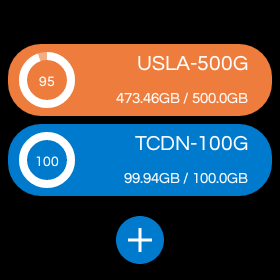

# android-wear-moniter
an android wear moniter for kiwivm or tencent cdn flow usage moniter

    

add you own    enter url of a json like below   


- KiwivmVps setting like this 

``` json
[
{
    "action": "",
    "match_full": "planMonthlyData",
    "match_used": "dataCounter",
    "res_name": "USLA-500G your name",
    "res_type": "KiwivmVps",
    "secret_id": "********",
    "secret_key": "**********",
    "service_type": "getServiceInfo"
  },
]

```

- Tencent CDN setting like this 
  only first package will be pick

``` json
[
{
    "action": "DescribeTrafficPackages",
    "match_full": "planMonthlyData",
    "match_used": "dataCounter",
    "res_name": "your name",
    "res_type": "TencentCloudCDN",
    "secret_id": "******",
    "secret_key": "******",
    "service_type": "cdn"
  }
  ]
```